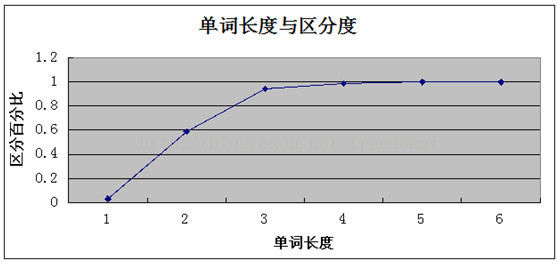

# 索引规约
---

> 红色 <font color=#FF0000 >*</font> 代表强制，必须遵循！<br />
> 看到一条分割线，即代表一个点结束


> ### 先贴上索引口诀：
> * 全值匹配我最爱，最左前缀要遵守 
> * 带头大哥不能死，中间兄弟不能断 
> * 索引列上少计算，范围之后全失效 
> * LIKE符号写最右，覆盖索引不写星 
> * 不等空值还有or，索引失效要少用 
> * var引号不能丢，SQL高级也不难 
> * 分组之前必排序，一定要上索引啊


### IndexStatute

* <font color=#FF0000 >*</font> 业务上具有唯一特性的字段，即使是组合字段，也必须建成唯一索引
> <font color=#977D06 >说明：</font> 不要以为唯一索引影响了 insert 速度，这个速度损耗可以忽略，但提高查找速度是明显的；另外，即使在应用层做了非常完善的校验控制，只要没有唯一索引，根据墨菲定律，必然有脏数据产生。

* <font color=#FF0000 >*</font> 超过三个表禁止 join。需要 join 的字段，数据类型保持绝对一致；多表关联查询时，保证被关联的字段需要有索引。
> <font color=#977D06 >说明：</font> 即使双表 join 也要注意表索引、SQL 性能。<br />
> <font color=#977D06 >注意：</font> 若查询出来的数据条数只是整个表的少部分数据，请使用嵌套查询（子查询）；若查询出来条数可能占整个表的70%以上，请使用join关联表
```java
* 正例： 
如果我只要找某几个学生的数据，我只需要用子查询逐个逐个找出来。而不是将全部学生的数据join一遍
```

* <font color=#FF0000 >*</font> 在 varchar 字段上建立索引时，必须指定索引长度，没必要对全字段建立索引，根据
实际文本区分度决定索引长度
> <font color=#977D06 >说明：</font> 索引的长度与区分度是一对矛盾体，一般对字符串类型数据，长度为 20 的索引，区分度会高达 90%以上，可以使用 `count(distinct left(列名, 索引长度))/count(*)`的区分度来确定。

> ### 索引长度与区分度矛盾关系
> * 索引长度太短，那么区分度就很低，索引占内存越低，
> * 索引长度太长，区分度就高，索引占内存越多，
> * 所以需要找到一个平衡点；
> * 那么怎么找整个平衡点呢？
> * 首先你要知道 mysql的索引都是排好序的。如果区分度高排序越快，区分度越低，排序慢；

```java
* 正例： 
（张，张三，张三哥），如果索引长度取1的话，那么每一行的索引都是 张 这个字，完全没有区分度，你让他怎么排序？
结果这样三行完全是随机排的，因为索引都一样；

如果长度取2，那么排序的时候至少前两个是排对了的，如果取3，区分度达到100%，排序完全正确；

等等，那你说是不是索引越长越好？  答案肯定是错的，比如 (张,李,王)  和 （张三啦啦啦，张三呵呵呵，张三呼呼呼）；
前者在内存中排序占得空间少，排序也快，后者明显更慢更占内存，在大数据应用中这一点点都是很恐怖的；

所以要做一个取舍；这个取舍不是没有一个固定的量；需要跟你自己的数据库里面的数据来判断；比较常规的公式是：
name是要加索引的字段，5是索引长度
select count(distinct left(name,5))/count(*) from table; 
```
求出一个浮点数，这个浮点数是逐渐趋向1的，网上找了个图片来分析下；


这个地方观察到，当索引长度达到4的时候就已经趋向1了，所以长度设为4是最佳的，在大点增加的索引效果已经很小了，这个地方不是说必须接近1才行；

**其实这个值达到0.1就已经可以接受了；总之要找一个平衡点；**

> * 还有一些特殊的字段常规方法用起不太顺畅，比如有一个url字段，绝大部分的url都是 http://www. 开头的
> * 这种情况下索引长度取取到11都是无效的，需要更长的索引，那么有没有优雅的方式来解决呢；
> * 方法一：可以将数据倒序存入数据库；
> * 方法二：对字符串进行crc32哈希处理；

---

* <font color=#FF0000 >*</font> 页面搜索严禁左模糊或者全模糊，如果需要请走搜索引擎来解决。
> <font color=#977D06 >说明：</font> 索引文件具有 B-Tree 的最左前缀匹配特性，如果左边的值未确定，那么无法使用此索引，全模糊也会失效。全模糊使用elasticsearch才能解决这个问题

<i class="el-icon-question" style="color:red"></i>
既然用了左模糊就无法走索引，那么我即想左模糊也想走索引？

<i class="el-icon-success" style="color:green"></i> 现有`user_info`表数据结构如下：
| ID       | USER_NAME           | AGE        
| ----------------- |:-------------:| --------:|  
| 1          | 易杰 | 70 | 1 | 
| 100          | 李荣杰      |   70 | 
| 110        | 张杰       |   17 |  
| 2        | 钱杰      |    38 |  

此表有一个`USER_NAME`字段的索引 `idx_user_name`

有个业务需求，需要模糊搜索出用户名后几位有**杰**这个词的所有用户信息，这时候不可能说为了一个搜索就引入ES，但是如果sql使用左模糊查询的话，根据索引的最左匹配原则，该sql语句是不可能使用到`idx_user_name`索引的，如下：
```java
SELECT * from USER_INFO where USER_NAME like '%杰'
```
发现是用不到索引的。需要做模糊匹配，又要用到索引，索引的最左匹配原则更是不能被打破，这时可增加一个字段，这个字段的内容等于`USER_NAME`字段内容的反转，同时加上这个字段的相关索引，如下：
| ID       | USER_NAME           | AGE            | REVERSE_USER_NAME               
| ----------------- |:-------------:| --------:|  --------:|  
| 1          | 易杰      | 70 |  杰易 | 
| 100        | 李荣杰    | 70 | 杰荣李 | 
| 110        | 张杰      | 17 |  杰张 | 
| 2          | 钱杰      | 38 |  杰钱 | 

此时如果是要模糊搜索出用户名后几位有杰这个词的所有用户信息，可对`REVERSE_USER_NAME`字段做右模糊查询，效果其实就是和对`USER_NAME`字段做左模糊查询是一样的，因为二者的内容是相反的，如下：
```java
SELECT * from USER_INFO where REVERSE_USER_NAME like '杰%'
```
> <font color=#977D06 >说明：</font> 索引的最左匹配原则不能打破，那么要让左匹配也走索引的话，换个思路，让右匹配的效果和左匹配一样就好了，同时右匹配又能走索引，间接达到了左模糊查询也能走索引的目的。

---

* 如果有 order by 的场景，请注意利用索引的有序性。order by 最后的字段是组合索引的一部分，并且放在索引组合顺序的最后，避免出现 file_sort（外部排序，就是把select的数据,按照order by的列 ，在内存中进行一次排序，然后返回结果） 的情况，影响查询性能
```java
* 正例： where a=? and b=? order by c; 索引：a_b_c（先order by a排序,再按b,再按c排序；组合索引本来就是排序过的）

* 反例： 索引如果存在范围查询，那么索引有序性无法利用，如：WHERE a>10 ORDER BY b; 索引 a_b 无法排序。
```

---

* 利用覆盖索引来进行查询操作，避免回表。<font color=#FF0000 >（SQL优化）</font>
> <font color=#977D06 >说明：</font> 如果一本书需要知道第 11 章是什么标题，会翻开第 11 章对应的那一页吗？目录浏览一下就好，这个目录就是起到覆盖索引的作用。
```java
* 正例： 能够建立索引的种类分为主键索引、唯一索引、普通索引三种，而覆盖索引只是一种查询的一种效
果，用 explain 的结果，extra 列会出现：using index。
```
<i class="el-icon-question" style="color:red"></i>
什么是回表查询？

<i class="el-icon-success" style="color:green"></i> 这先要从InnoDB的索引实现说起，InnoDB有两大类索引：
> * 聚集索引(clustered index)
> * 普通索引(secondary index)

> ### InnoDB聚集索引和普通索引有什么差异？
> * InnoDB聚集索引的<font color=#FF0000 >叶子节点存储行记录</font>，因此， InnoDB必须要有，且只有一个聚集索引：
>    >  如果表定义了PK，则PK就是聚集索引；<br />
>    >  如果表没有定义PK，则第一个not NULL unique列是聚集索引；<br />
>    >  否则，InnoDB会创建一个隐藏的row-id作为聚集索引；<br />
>    >  **所以PK查询非常快，直接定位行记录。**
> * InnoDB普通索引的<font color=#FF0000 >叶子节点存储主键值</font>。
>    >  注意，不是存储行记录头指针，MyISAM的索引叶子节点存储记录指针。

<i class="el-icon-edit" style="color:green"></i> 举个栗子，不妨设有表：
`t(id PK, name KEY, sex, flag);`

id是聚集索引，name是普通索引。

表中有四条记录：
| ID       | USER_NAME           | M            | TYPE               
| ----------------- |:-------------:| --------:|  --------:|  
| 1        | shenjian      | m |  A | 
| 3        | zhangsan    | m | A | 
| 5        | lisi      | m |  A | 
| 9        | wangwu      | f |  B | 


* 两个B+树索引分别如上图：
    > * id为PK，聚集索引，叶子节点存储行记录；
    > * name为KEY，普通索引，叶子节点存储PK值，即id；

既然从普通索引无法直接定位行记录，那普通索引的查询过程是怎么样的呢？

通常情况下，需要扫码两遍索引树。

例如：`select * from t where name='lisi';　`

是如何执行的呢？


* 如粉红色路径，需要扫码两遍索引树：
    > * 先通过普通索引定位到主键值id=5；
    > * 在通过聚集索引定位到行记录；

这就是所谓的**回表查询**，先定位主键值，再定位行记录，它的性能较扫一遍索引树更低。

<i class="el-icon-question" style="color:red"></i>
什么是索引覆盖(Covering index)？

<i class="el-icon-success" style="color:green"></i> 
MySQL官网，类似的说法出现在explain查询计划优化章节，即explain的输出结果Extra字段为Using index时，能够触发索引覆盖。


不管是SQL-Server官网，还是MySQL官网，都表达了：只需要在一棵索引树上就能获取SQL所需的所有列数据，无需回表，速度更快。

<i class="el-icon-question" style="color:red"></i>
如何实现索引覆盖？

<i class="el-icon-success" style="color:green"></i>  将被查询的字段，建立到联合索引里去。
```java
create table user (
    id int primary key,
    name varchar(20),
    sex varchar(5),
    index(name)
)engine=innodb;

请看第一条sql：
select id,name from user where name='shenjian';　
能够命中name索引，索引叶子节点存储了主键id，通过name的索引树即可获取id和name，无需回表，符合索引覆盖，效率较高。
Extra：Using index。聚集索引

请看第二条sql：
select id,name,sex from user where name='shenjian';
能够命中name索引，索引叶子节点存储了主键id，但sex字段必须回表查询才能获取到，不符合索引覆盖，
需要再次通过id值扫码聚集索引获取sex字段，效率会降低。
Extra：Using index condition。普通索引

如果把(name)单列索引升级为联合索引(name, sex)就不同了。
create table user (
    id int primary key,
    name varchar(20),
    sex varchar(5),
    index(name, sex)
)engine=innodb;

select id,name ... where name='shenjian';
select id,name,sex ... where name='shenjian';
都能够命中索引覆盖，无需回表。
Extra：Using index。
```

<i class="el-icon-question" style="color:red"></i>
哪些场景可以利用索引覆盖来优化SQL？

<i class="el-icon-success" style="color:green"></i> 
场景1：全表count查询优化
```java
原表：user(PK id, name, sex)；

select count(name) from user;
不能利用索引覆盖。

添加索引：alter table user add key(name);
就能够利用索引覆盖提效。
```
<i class="el-icon-success" style="color:green"></i> 
场景2：列查询回表优化
```java
select id,name,sex ... where name='shenjian';

将单列索引(name)升级为联合索引(name, sex)，即可避免回表。
```

<i class="el-icon-success" style="color:green"></i> 
场景3：分页查询
```java
select id,name,sex ... order by name limit 500,100;

将单列索引(name)升级为联合索引(name, sex)，也可以避免回表。
```

**InnoDB聚集索引普通索引，回表，索引覆盖**

---

* 利用延迟关联或者子查询优化超多分页场景
> <font color=#977D06 >说明：</font> MySQL 并不是跳过 offset 行，而是取 offset+N 行，然后返回放弃前 offset 行，返回 N 行，那当
offset 特别大的时候，效率就非常的低下，要么控制返回的总页数，要么对超过特定阈值的页数进行 SQL改写<br />
> <font color=#977D06 >注意：</font> 延迟关联：使用索引查询出来数据，之后把查询结果和同一张表中数据进行连接查询，进而提高查询速度!
```java
* 正例： 先快速定位需要获取的 id 段，然后再关联：
子查询通过id主键索引查出来，在和同一张表的数据进行连接

SELECT t1.* FROM 表 1 as t1, (select id from 表 1 where 条件 LIMIT 100000,20 ) as t2 
where t1.id=t2.id
```

* SQL 性能优化的目标：至少要达到 range 级别，要求是 ref 级别，如果可以是 consts最好
> <font color=#977D06 >说明：</font> <br />
> consts 单表中最多只有一个匹配行（主键或者唯一索引），在优化阶段即可读取到数据。<br />
> ref 指的是使用普通的索引（normal index）。<br />
> range 对索引进行范围检索

```java
* 反例： explain 表的结果，type=index，索引物理文件全扫描，速度非常慢，这个 index 级别比较 range
还低，与全表扫描是小巫见大巫。
```

* 建组合索引的时候，区分度最高的在最左边
```java
* 正例： 如果 where a=? and b=?，a 列的几乎接近于唯一值，那么只需要单建 idx_a 索引即可。
```
> <font color=#977D06 >说明：</font> 存在非等号和等号混合判断条件时，在建索引时，请把等号条件的列前置。如：where c>? and d=? 
那么即使 c 的区分度更高，也必须把 d 放在索引的最前列，即建立组合索引 idx_d_c。

* 创建索引时避免有如下极端误解：
> 索引宁滥勿缺。认为一个查询就需要建一个索引。<br />
> 吝啬索引的创建。认为索引会消耗空间、严重拖慢记录的更新以及行的新增速度。<br />
> 抵制惟一索引。认为惟一索引一律需要在应用层通过“先查后插”方式解决。

---


> 参考文档
> * [根据实际文本区分度决定索引长度](https://blog.csdn.net/qq_20789179/article/details/108118327)
> * [MySQL优化：如何避免回表查询？什么是索引覆盖？](https://www.cnblogs.com/myseries/p/11265849.html)